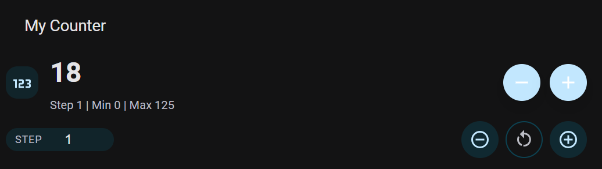

# Counter Card

A Lovelace card for Home Assistant to control counter helpers.



## Features

- Increment and decrement the counter.
- Increment and decrement the counter by a custom step value.
- Reset the counter to its initial value.
- Error handling for when the entity is not a counter.

## Installation

1. Copy `counter-card.js` to your `www` directory in your Home Assistant configuration directory.
2. Add the card to your Lovelace UI.

## Usage

Add the following to your Lovelace YAML:

```yaml
- type: custom:counter-card
  entity: counter.my_counter
  title: My Counter
  step: 1
```

## “Add to Home Assistant” button (for dashboards)

If you want the Add to Home Assistant badge that opens Lovelace resources directly, use:

[](https://my.home-assistant.io/redirect/lovelace_add_card/?url=/hacsfiles/counter-card/counter-card.js)


This one is mainly used for dashboards when the resource is already installed.

## Version

1.1.8
